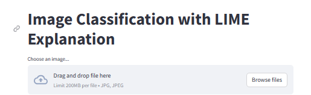
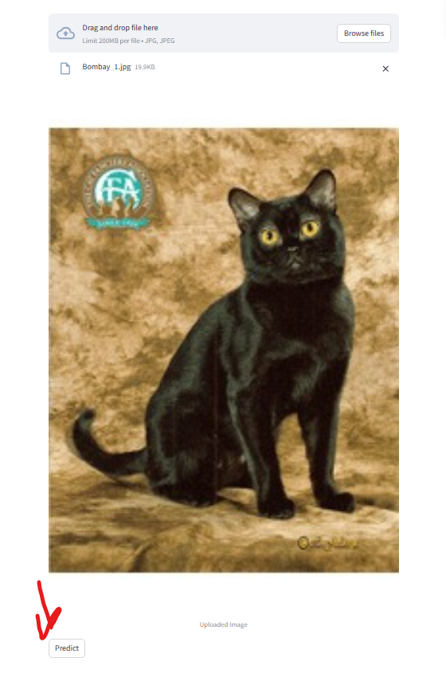
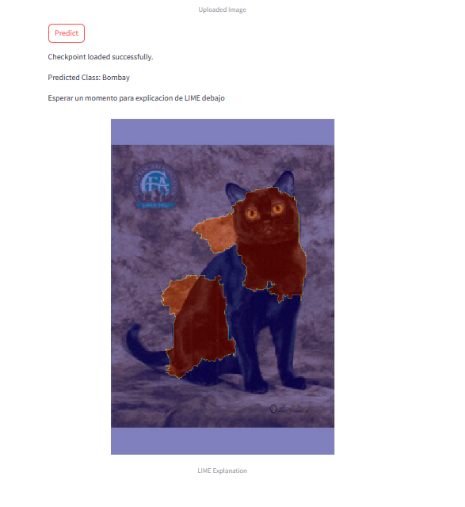

# No_estructurado Hugo Castro Campos y Alfonso R Cedillo Mayorga
Trabajo para el modulo de analisis no estructurado del master de big data y analitica avanzada de ICAI\
Hugo Castro: 
Alfonso Cedillo: 202313838@alu.comillas.edu
## Overview
El proyecto tiene como objetivo entrenar un modelo pequeño pero eficiente en la clasificacion de imagenes de mascotas.\
Se exploraran varios modelos conocidos para intentar obtener el mejor resultado,\
asi como las razones por las que se tienen errores en imagenes especificas de los modelos mediante explicabilidad de imagenes de lime.\
Los notebooks aon donde se encuentra la mayor parte del contenido sobre modelos de prueba, con el principal sobre el modelo elegido siendo el shuffle net.\

## App
Para poder realizar la actividad de manera interactiva, se implemento todo dentro de una app de streamlit, en la que si se inserta un jpg,\
se recibira la prediccion junto con su explicacion en lime.
## Instrucciones
Para runnear la app de streamlit, runnear esto en consola, dentro de un environment que tenga los requerimientos:
Se vera asi, y se runneara con el comando que esta abajo.

Puede elegirse cualquiera de las imagenes dentro del dataset o alguna de internet, con tal de que sea un jpg, deberia funcionar con certeza.


```bash
streamlit run streamlit2.py
```
Entonces aparecera esto en el local:
## Imágenes

Aqui habra que introducir una imagen jpg.
\
Aqui despues de predecir, tambien saldra automaticamente la explicacion de LIME.\



Gracias por ver nuestro proyecto.
